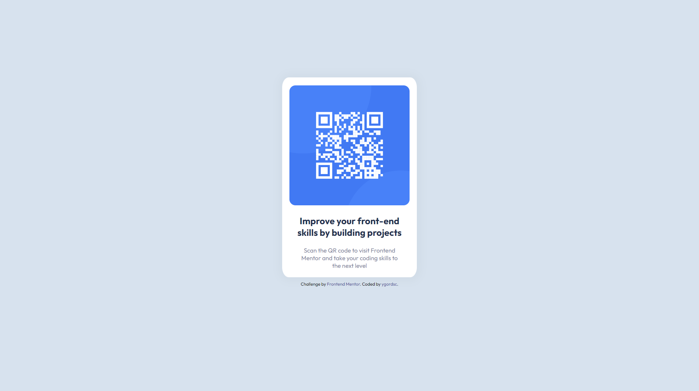

# Frontend Mentor - QR code component solution

This is a solution to the [QR code component challenge on Frontend Mentor](https://www.frontendmentor.io/challenges/qr-code-component-iux_sIO_H). Frontend Mentor challenges help you improve your coding skills by building realistic projects. 

## Table of contents

- [Overview](#overview)
  - [Screenshot](#screenshot)
  - [Links](#links)
- [My process](#my-process)
  - [Built with](#built-with)
  - [What I learned](#what-i-learned)
  - [Useful resources](#useful-resources)
- [Author](#author)


## Overview

### Screenshot



### Links

- Live Site URL: (https://ygordsc.github.io/frontendmentor-qrcode/)


## My process

### Built with

- Semantic HTML5 markup
- CSS custom properties

### What I learned

I practiced the html and css basics that i recently learned, so i'm proud of solving it. But actually i didn't manage to make it perfectly identical, because the final design has a little bigger gap between the text and the bottom of the box. So if anyone is reading this and know how to do it, i would appreciate some help :)

```css
.proud-of-this-css .main {
    display: flex; 
    flex-direction: column; 
    align-items: center;
    height: 500px;
    max-width: 336px;
    justify-content: center;
    margin-top: 20vh;
    background-color: hsl(0, 0%, 100%);
    border-radius: 5%;
    box-shadow: 1px 1px 20px 10px #d1dce8;
}
```

### Useful resources

- [Resource 1](https://www.w3schools.com/cssref/css3_pr_box-shadow.php) - This helped me understanding the functioning of shadow boxes, the "Try it Yourself" is a real life-saver


## Author

- Frontend Mentor - [@yourusername](https://www.frontendmentor.io/profile/ygordsc)
- Twitter - [@ygordsc](https://www.twitter.com/ygordsc)
- Discord - rogy#4181


